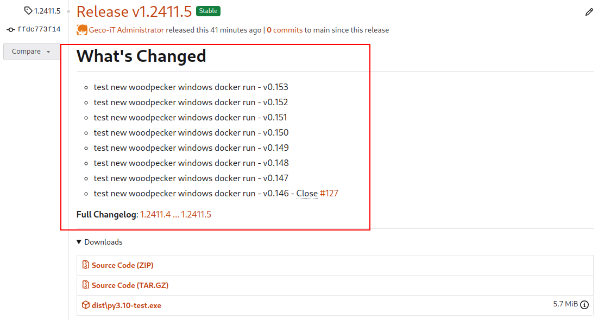

# Woodpecker CI - Git Basic Changelog Plugin

Generate a **CHANGELOG.md** file with all commit logs since the last TAG

* Advanced generator: <https://pawamoy.github.io/git-changelog>

## Settings

| Settings Name | Default | Description         |
| ------------- | ------- | ------------------- |
| `debug`       | _false_ | Enable _DEBUG_ mode |

## Pipeline Usage

```yaml
...
clone:
  git:
    # settings for generate-basic-changelog plugin
    settings:
      depth: 0
      partial: false
      tags: true  # if you use event push for this plugin

steps:
  generate-basic-changelog:
    image: <REPO_URL>/woodpecker-git-basic-changelog-plugin
  settings:
    debug: true
    when:
      event: tag
...
```

## Example changelog generated

```bash
$ cat CHANGELOG.md 
# What's Changed

- test new woodpecker windows docker run - v0.153
- test new woodpecker windows docker run - v0.152
- test new woodpecker windows docker run - v0.151
...
_**Full Changelog**__: [1.2411.4 ... 1.2411.5](https://...)
```


