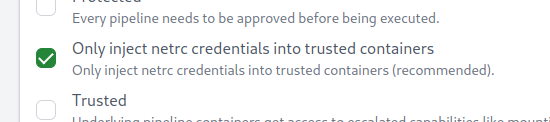

# Woodpecker CI - Git Clone plugin

- Documentation: <https://woodpecker-ci.org/plugins/Git%20Clone>
- Source: <https://github.com/woodpecker-ci/plugin-git>

For enable Trusted netrc:



You must retag your git-plugin

```bash
C:\> docker image tag \
            gecoit84/woodpecker-git-plugin:latest \
            woodpeckerci/plugin-git:latest
```

You must add to our pipeline

```yaml
...
clone:
  - name: clone
    image: woodpeckerci/plugin-git
    pull: false

steps:
...
```

- trustedClonePlugins: <https://github.com/woodpecker-ci/woodpecker/blob/main/shared/constant/constant.go>

```go
...
const (
	// DefaultClonePlugin can be changed by 'WOODPECKER_DEFAULT_CLONE_PLUGIN' at runtime.
	// renovate: datasource=docker depName=woodpeckerci/plugin-git
	DefaultClonePlugin = "docker.io/woodpeckerci/plugin-git:2.6.0"
)

// TrustedClonePlugins can be changed by 'WOODPECKER_PLUGINS_TRUSTED_CLONE' at runtime.
var TrustedClonePlugins = []string{
	DefaultClonePlugin,
	"docker.io/woodpeckerci/plugin-git",
	"quay.io/woodpeckerci/plugin-git",
}
...
```
