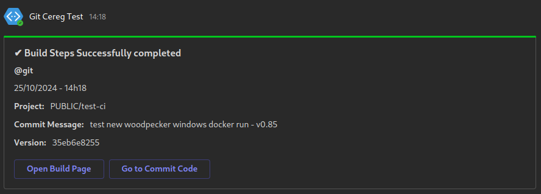
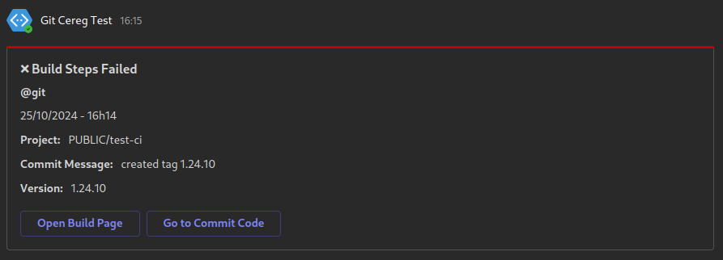

# Woodpecker CI - Teams Notify plugin

Woodpecker Windows plugin to send teams notifications for build status

For create an Teams Webhook follow [this](https://learn.microsoft.com/en-us/microsoftteams/platform/webhooks-and-connectors/how-to/add-incoming-webhook)

We use __file.exe__ tool for detect type mime from <https://gnuwin32.sourceforge.net/packages/file.htm>

## Settings

| Settings Name | Default | Description               |
| ------------- | ------- | ------------------------- |
| `url`        | _none_  | Teams Webhook URL |
| `private_forge`    | _false_  | Set this to true if your forge is not accessible to the world |
| `debug` | _false_ | Enable Debug mode |

## Pipeline Usage

```yaml
...
steps:
  teams-notify:
    image: <REPO_URL>/woodpecker-teams-notify-plugin
    settings:
      url:
        from_secret: teams_webhook
    when:
      - status: [success, failure]
        event: tag
...
```

## Teams result

* Success Build Notifcation



* Failed Build Notifcation


